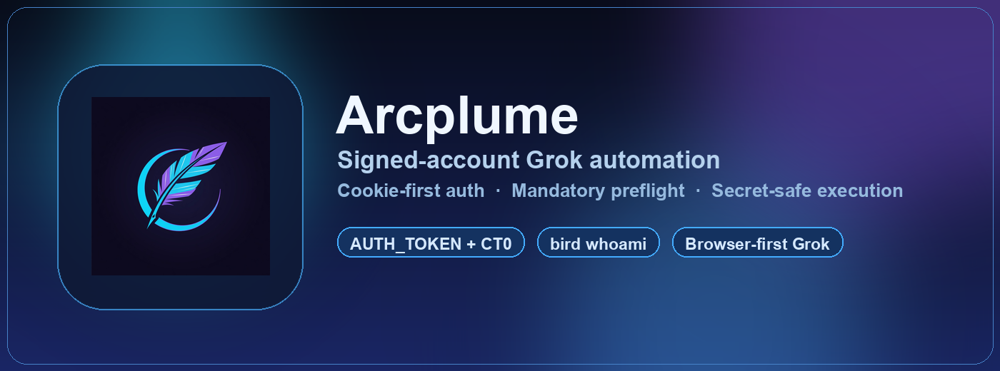

<div align="center">

# 🪽 Arcplume

**Reliable Grok automation through your signed-in X account — with strict auth checks and zero secret leakage.**





<video src="./assets/readme/arcplume-logo-animation.mp4" controls loop muted playsinline width="90%"></video>

</div>

---

## The problem Arcplume solves

Most Grok workflows are fragile because they mix two different execution modes:

1. **Signed-account mode** (cookie/session-backed; what users often mean)
2. **API mode** (`XAI_API_KEY`; a different contract)

That confusion causes silent fallbacks, broken auth, and accidental secret exposure.

**Arcplume fixes this with explicit boundaries, mandatory preflight, and safe defaults.**

---

## What Arcplume guarantees

- ✅ **Cookie-first execution** using `AUTH_TOKEN` + `CT0`
- ✅ **Mandatory identity check** (`bird whoami`) before real work
- ✅ **Browser-first default** for account-bound Grok behavior
- ✅ **No-secret output policy** (tokens never printed)
- ✅ **No silent mode-switching** from cookie mode to API mode
- ✅ **Clear failure remediation** when credentials are missing/expired

---

## Trust boundaries (important)

| Mode | Trigger | Auth | Default? | Notes |
|---|---|---|---|---|
| Signed-account (cookie) | User asks for local/signed-in Grok | `AUTH_TOKEN` + `CT0` | **Yes** | Preferred for account-bound UI behavior |
| API mode | User explicitly requests API | `XAI_API_KEY` | No | Never auto-selected from cookie mode |

---

## Install

```bash
mkdir -p ~/.craft-agent/workspaces/my-workspace/skills/arcplume
cp SKILL.md ~/.craft-agent/workspaces/my-workspace/skills/arcplume/SKILL.md
craft-agent skill validate arcplume
```

---

## Credential resolution order

Arcplume resolves credentials in this order:

1. Environment (`AUTH_TOKEN`, `CT0`)
2. `~/.claude/.env`
3. `~/.config/bird/config.json5`

> Raw credential values are never echoed.

---

## Quick start

### 1) Preflight (required)

```bash
scripts/preflight.sh
```

Expected: `bird whoami` succeeds.

### 2) Run a repeatable video endpoint test (optional)

```bash
scripts/test-video.sh \
  --prompt "Arcplume logo reveal, dark background, cyan-violet glow, no text" \
  --duration 5 \
  --out ./arcplume-teaser.mp4
```

This validates async request flow (`pending` → `done`) and artifact download.

---

## Security posture

Arcplume is designed for least exposure:

- No token logging
- No secret persistence in generated artifacts
- Deterministic preflight before execution
- Confirmation before state-changing actions

See [SECURITY.md](./SECURITY.md) for full threat model + incident response.

---

## Repository contents

```text
.
├── SKILL.md
├── README.md
├── SECURITY.md
├── CHANGELOG.md
├── scripts/
│   ├── load-cookies.sh
│   ├── preflight.sh
│   └── test-video.sh
├── icon.png
└── .github/workflows/validate-skill.yml
```

---

## Release

- Current stable: **[v1.0.0](https://github.com/Sheshiyer/arcplume/releases/tag/v1.0.0)**
- Changelog: [CHANGELOG.md](./CHANGELOG.md)
- skills.sh metadata: [skills-sh-submission.md](./skills-sh-submission.md)

---

## Brand assets

- Icons: [branding/rebrand-2026-05/icons](./branding/rebrand-2026-05/icons)
- Teaser notes: [branding/rebrand-2026-05/teasers/README.md](./branding/rebrand-2026-05/teasers/README.md)

---

Built for operators who care about reliability, auth clarity, and safe automation.